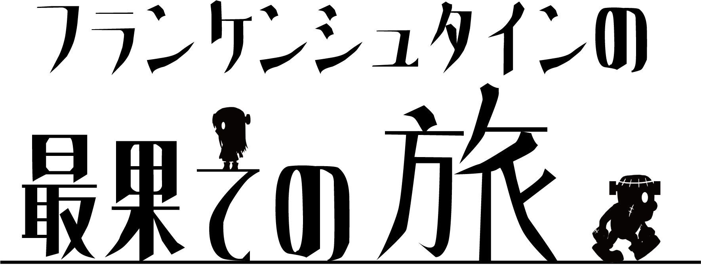

# フランケンの最果ての旅


<table style="width:80%">
  <tr>
    <td>制作期間</td> <td>2021.4 ~ 2021.9</td>
  </tr>

  <tr>
    <td>制作人数</td> <td>12人</td>
  </tr>
  
  <tr>
    <td>役職</td> <td>プログラマー</td>
  </tr>
  
  <tr>
    <td>ジャンル</td><td>2Dスクロール謎解きアクション</td>
  </tr>
  
  <tr>
    <td>プラットフォーム</td><td>PC</td>
  </tr>
  
  <tr>
    <td>使用言語</td> <td>Unity C#</td>
  </tr>
  
  <tr>
    <td>GitHub</td> <td><a href="https://github.com/kannaduki2000/TravelFrankenstein">GitHubはこちら</a></td>
  </tr>
  
  <tr>
    <td>動画</td> <td><a href="hogehoge">YouTube(準備中)</a></td>
  </tr>
</table>


# 主な仕事
## フラグマネージャークラスの作成
* 使いやすく、わかりやすいように作成しました
```
public class EventFlag
{
    public EventFlagName flagName;   // フラグの名前
    public bool isTrue;              // フラグの状態
    public EventFlag(EventFlagName _flagName, bool _isTrue = true)
    {
        this.flagName = _flagName;
        this.isTrue = _isTrue;
    }
}
```

```
// イベント実行中かどうかを判別するフラグ
public bool EventFlag { get; set; }

private EventFlag[] flags = new EventFlag[0];

/// <summary>
/// 指定した名前のフラグ状態を取得する
/// </summary>
/// <param name="flagName"></param>
/// <returns></returns>
public bool GetFlagState(EventFlagName flagName)
{
    bool state = true;
    EventFlag targetFlag = FindFlag(flagName);

    if (targetFlag == null)
    {
        Debug.Log(flagName + "という名前のフラグはないよ！");
    }
    else
    {
        state = targetFlag.isTrue;
    }

    return state;
}

/// <summary>
/// 指定した名前のフラグの状態を設定する
/// </summary>
/// <param name="flagName"></param>
/// <param name="flag"></param>
public void SetFlagState(EventFlagName flagName, bool flag)
{
    EventFlag targetFlag = FindFlag(flagName);
    targetFlag = targetFlag ?? AddFlag(flagName);

    targetFlag.isTrue = flag;
}

/// <summary>
/// 全てのフラグの状態をコンソール上に表示する
/// </summary>
public void DumpAllFlag()
{
    Debug.Log("----- FlagDump Start -----");
    foreach (EventFlag flag in flags)
    {
        Debug.Log($"{flag.flagName} : {flag.isTrue}");
    }
    Debug.Log("----- FlagDump End -----");
}

/// <summary>
/// フラグを全て消去する
/// </summary>
public void ClearAllFlag()
{
    flags = new EventFlag[0];
}

/// <summary>
/// フラグを全てfalseにする
/// </summary>
public void ResetAllFlag()
{
    for (int i = 0; i < flags.Length; i++)
    {
        flags[i].isTrue = false;
    }
}

/// <summary>
/// 指定した名前のフラグを検索する
/// </summary>
/// <param name="flagName"></param>
/// <returns></returns>
private EventFlag FindFlag(EventFlagName flagName)
{
    EventFlag resultFlag = null;
    foreach (EventFlag flag in flags)
    {
        if (flag.flagName == flagName)
        {
            resultFlag = flag;
            break;
        }
    }

    return resultFlag;
}

/// <summary>
/// 指定した名前のフラグを追加する
/// </summary>
/// <param name="flagName"></param>
/// <returns></returns>
public EventFlag AddFlag(EventFlagName flagName)
{
    System.Array.Resize(ref flags, flags.Length + 1);
    int newElement = flags.Length - 1;
    flags[newElement] = new EventFlag(flagName);

    return flags[newElement];
}

```

## 電気を入れるオブジェクトの親クラスの作成
* 親クラスに必要な要素をまとめ、子クラスが継承した際に参照しやすいように制作しました
```
public class ElectricItem : MonoBehaviour
{
    public int Power { get; set; } = 0;                 // 消費電力
    public bool ChargeFlag { get; set; } = false;       // 電気を入れてあるかどうか　OnOff可能
    public bool IsCharge { get; set; } = false;         // Playerが充電できるか
    public bool IsChargeEvent { get; set; } = false;    // Event実行済かどうか　Onのみ
    public bool IsThrow { get; set; } = false;          // 投げれるObjectかどうか

    public virtual void Event() { }
    public virtual void ChargeEvent() { }

}
```

<a href="https://kumamoooooon0202.github.io/Portfolio/">←プロフィールに戻る</a>
