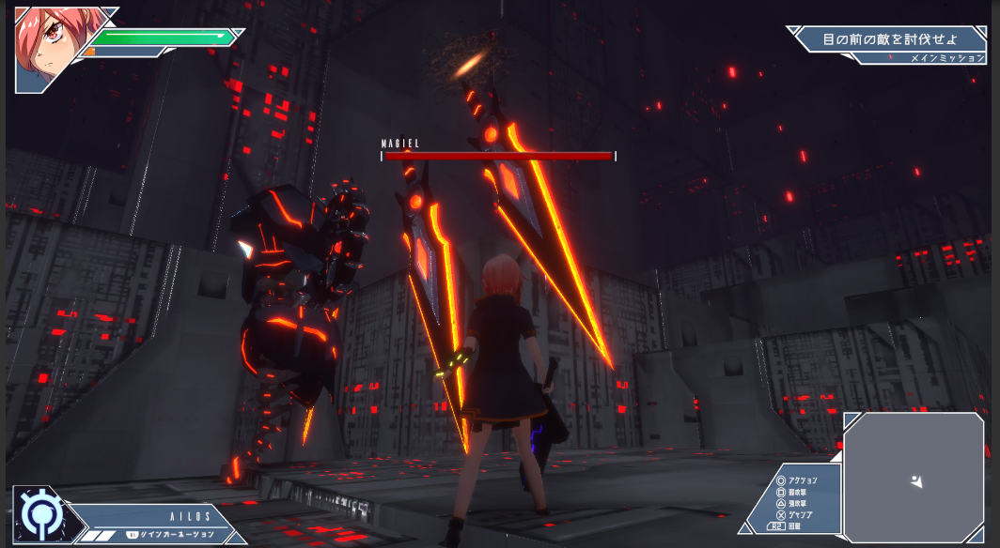
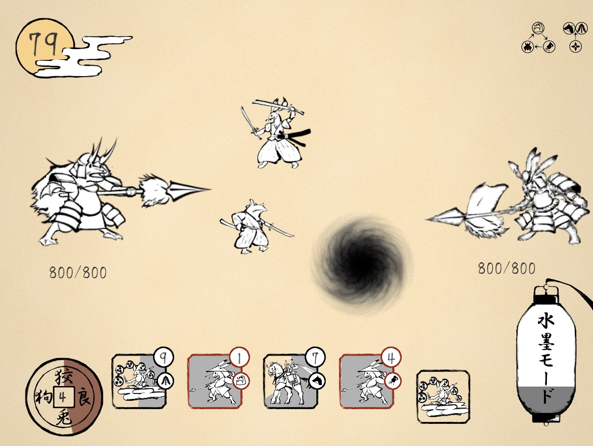

# プロフィール
## 自己紹介
<!--
|     名前    | null |
|     所属    | null |
|     専攻    | null |

-->

<table style="width:100%">
  <tr>
    <td>名前</td> <td>熊倉豊倫</td>
  </tr>

  <tr>
    <td>所属</td> <td>東京デザインテクノロジーセンター専門学校</td>
  </tr>
  
  <tr>
    <td>専攻</td> <td>スーパーゲームクリエイター専攻</td>
  </tr>
</table>

## スキル
<!--
| 言語 | 使用ツール | 期間 | 経験年数 | 備考 |
| :-----: | :-----: | :-----: | :--------: | :-----: |
| C | VisualStudio | 2015.4 ~ 現在 | 6年 | 高校、専門学校の授業で学びました。 |
| C++ | VisualStudio | 2017.4 ~ 現在 | 4年 | 高校、専門学校の授業で学びました。 |
| C# | Unity | 2017.8 ~ 現在 | 4年 | 自主的に学び始め、専門学校の授業でも学びました。 |
| PHP | SQL | 2019.4 ~ 2020.3 | 1年 | 専門学校の授業で軽く学びました。 |
| VBA | Excel | 2017.4 ~ 2018.3 | 1年 | 高校の授業で軽く学びました。 |
| CSS | HTML | 2018.7 ~ 現在 | 3年 | 専門学校の授業で学びました。 |
-->
<table style="width:100%">
  <tr>
    <th>言語</th> <th>使用ツール</th> <th>期間</th> <th nowrap>経験年数</th> <th>備考</th>
  </tr>

  <tr>
    <td>C</td> <td>VisualStudio</td> <td>2015.4 ~ 現在</td> <td nowrap>6年</td> <td>高校、専門学校の授業で学びました。</td>
  </tr>
  
  <tr>
    <td>C++</td> <td>VisualStudio</td> <td>2017.4 ~ 現在</td> <td nowrap>4年</td> <td>高校、専門学校の授業で学びました。</td>
  </tr>
  
  <tr>
    <td>C#</td> <td>Unity</td> <td>2017.8 ~ 現在</td> <td nowrap>4年</td> <td>自主的に学び始め、専門学校の授業でも学びました。</td>
  </tr>
  
  <tr>
    <td>PHP</td> <td>SQL</td> <td>2019.4 ~ 2020.3</td> <td nowrap>1年</td> <td>専門学校の授業で軽く学びました。</td>
  </tr>

  <tr>
    <td>VBA</td> <td>Excel</td> <td>2017.4 ~ 2018.3</td> <td nowrap>1年</td> <td>高校の授業で軽く学びました。</td>
  </tr>
  
  <tr>
    <td>CSS</td> <td>HTML</td> <td>2018.7 ~ 現在</td> <td nowrap>3年</td> <td>専門学校の授業で学び、今でも自主的に学んでいます。</td>
  </tr>
</table>

# 目次

<!--
|     制作期間    | null |
|     制作人数    | null |
|       役職      | null |
|     ジャンル    | null |
| プラットフォーム | null |
|     使用言語    | null |
|      GutHub     | null |
|   ソースコード   | null |
|       動画      | null |
-->

## 1.World Of Symbols
<table style="width:80%">
  <tr>
    <td>制作期間</td> <td>2019.4 ~ 2019.9</td>
  </tr>

  <tr>
    <td>制作人数</td> <td>10人</td>
  </tr>
  
  <tr>
    <td>役職</td> <td>プログラマー</td>
  </tr>
  
  <tr>
    <td>ジャンル</td> <td>アクションRPG</td>
  </tr>
  
  <tr>
    <td>プラットフォーム</td> <td>PC</td>
  </tr>
  
  <tr>
    <td>使用言語</td> <td>Unity C#</td>
  </tr>
  
  <tr>
    <td>GitHub</td> <td><a href="https://github.com/mamanju/WorldOfSymbols">GitHubはこちら</a></td>
  </tr>
  
  <tr>
    <td>ソースコード</td> <td><a href="WorldOfSymbols.html">準備中</a></td>
  </tr>
  
  <tr>
    <td>動画</td> <td>準備中</td>
  </tr>
</table>

## 2.UNDER HEAVEN

<table style="width:80%">
  <tr>
    <td>制作期間</td> <td>2019.3 ~ 2020.2</td>
  </tr>

  <tr>
    <td>制作人数</td> <td>18人</td>
  </tr>
  
  <tr>
    <td>役職</td> <td>プログラマー</td>
  </tr>
  
  <tr>
    <td>ジャンル</td> <td>アクションRPG</td>
  </tr>
  
  <tr>
    <td>プラットフォーム</td> <td>PC</td>
  </tr>
  
  <tr>
    <td>使用言語</td> <td>Unity C#</td>
  </tr>
  
  <tr>
    <td>GitHub</td> <td>非公開</td>
  </tr>
  
  <tr>
    <td>ソースコード</td> <td><a href="./UnderHeaven.html">こちら</a></td>
  </tr>
  
  <tr>
    <td>動画</td> <td>準備中</td>
  </tr>
</table>

## 3.水墨鳥獣

<table style="width:80%">
  <tr>
    <td>制作期間</td> <td>2020.5 ~ 2021.2</td>
  </tr>

  <tr>
    <td>制作人数</td> <td>9人</td>
  </tr>
  
  <tr>
    <td>役職</td> <td bgcolor=cyan>プログラマーリーダー</td>
  </tr>
  
  <tr>
    <td>ジャンル</td> <td>タワーディフェンス</td>
  </tr>
  
  <tr>
    <td>プラットフォーム</td> <td>タブレット</td>
  </tr>
  
  <tr>
    <td>使用言語</td> <td>Unity C#</td>
  </tr>
  
  <tr>
    <td>GitHub</td> <td><a href="https://github.com/kumamoooooon0202/RabbitFrog.git">GitHubはこちら</a></td>
  </tr>
  
  <tr>
    <td>ソースコード</td> <td><a href="RabbitFrog.html">こちら</a></td>
  </tr>
  
  <tr>
    <td>動画</td> <td>準備中</td>
  </tr>
</table>

## 4.HoloJewelry ～煌めきからの脱出～
<table style="width:80%">
  <tr>
    <td>制作期間</td> <td>2020.5 ~ 2021.3</td>
  </tr>

  <tr>
    <td>制作人数</td> <td>8人</td>
  </tr>
  
  <tr>
    <td>役職</td> <td>プログラマー</td>
  </tr>
  
  <tr>
    <td>ジャンル</td> <td>体験型脱出MRゲーム</td>
  </tr>
  
  <tr>
    <td>プラットフォーム</td> <td>HoloLens2</td>
  </tr>
  
  <tr>
    <td>使用言語</td> <td>Unity C#</td>
  </tr>
  
  <tr>
    <td>GitHub</td> <td>非公開</td>
  </tr>
  
  <tr>
    <td>ソースコード</td> <td>非公開</td>
  </tr>
  
  <tr>
    <td>動画</td> <td><a href="https://youtu.be/h6OG0eIbWyk">YouTube</a></td>
  </tr>
</table>

## 5.ColorChrome
<table style="width:80%">
  <tr>
    <td>制作期間</td> <td>2021.4 ~ 制作中</td>
  </tr>

  <tr>
    <td>制作人数</td> <td>18人</td>
  </tr>
  
  <tr>
    <td>役職</td> <td>プログラマー</td>
  </tr>
  
  <tr>
    <td>ジャンル</td> <td>アクションRPG</td>
  </tr>
  
  <tr>
    <td>プラットフォーム</td> <td>PC</td>
  </tr>
  
  <tr>
    <td>使用言語</td> <td>Unity C#</td>
  </tr>
  
  <tr>
    <td>GitHub</td> <td>非公開</td>
  </tr>
  
  <tr>
    <td>ソースコード</td> <td>制作中</td>
  </tr>
  
  <tr>
    <td>動画</td> <td>制作中</td>
  </tr>
</table>

## 6.フランケンシュタインの最果ての旅
<table style="width:80%">
  <tr>
    <td>制作期間</td> <td>2021.4 ~ 制作中</td>
  </tr>

  <tr>
    <td>制作人数</td> <td>13人</td>
  </tr>
  
  <tr>
    <td>役職</td> <td>プログラマー</td>
  </tr>
  
  <tr>
    <td>ジャンル</td> <td>RPG</td>
  </tr>
  
  <tr>
    <td>プラットフォーム</td> <td>PC</td>
  </tr>
  
  <tr>
    <td>使用言語</td> <td>Unity C#</td>
  </tr>
  
  <tr>
    <td>GitHub</td> <td><a href="https://github.com/kannaduki2000/Frankenstein">GitHubはこちら</a></td>
  </tr>
  
  <tr>
    <td>ソースコード</td> <td>制作中</td>
  </tr>
  
  <tr>
    <td>動画</td> <td>制作中</td>
  </tr>
</table>
