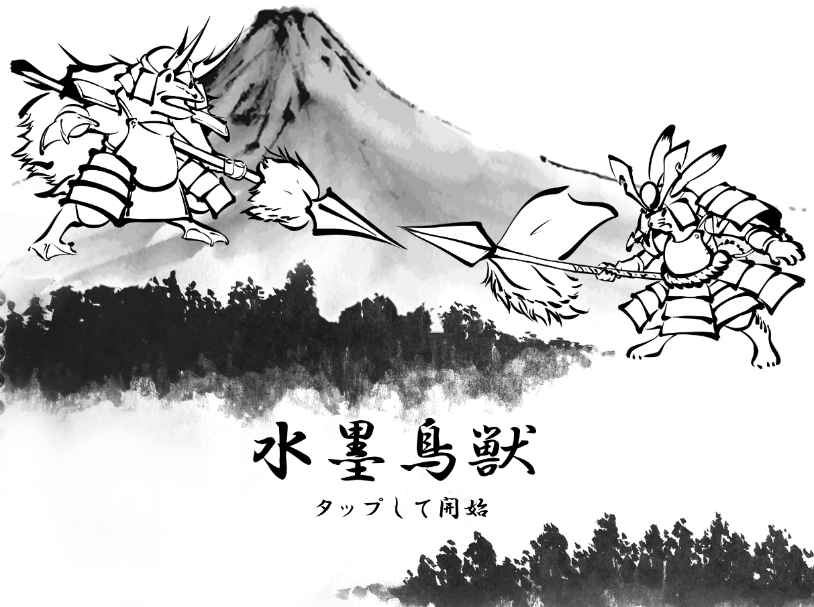

# 水墨鳥獣


<table style="width:80%">
  <tr>
    <td>制作期間</td> <td>2020.5 ~ 2021.2</td>
  </tr>

  <tr>
    <td>制作人数</td> <td>9人</td>
  </tr>
  
  <tr>
    <td>役職</td> <td bgcolor=cyan>プログラマーリーダー</td>
  </tr>
  
  <tr>
    <td>ジャンル</td> <td>タワーディフェンス</td>
  </tr>
  
  <tr>
    <td>プラットフォーム</td> <td>ios</td>
  </tr>
  
  <tr>
    <td>使用言語</td> <td>Unity C#</td>
  </tr>
  
  <tr>
    <td>GitHub</td> <td><a href="https://github.com/kumamoooooon0202/RabbitFrog.git">GitHubはこちら</a></td>
  </tr>
  
  <tr>
    <td>動画</td> <td>準備中</td>
  </tr>
</table>

# 主な作業内容

## キャラクター周り全般
## 編成画面


### 設定した編成を反映する処理
```csharp
[System.Serializable]
public class AutoDeckArray
{
    [Header("自動セットしたいカード")]
    public CardPoolObject[] autoSet = new CardPoolObject[8];
}
```

```csharp
public class AutoDeckSet : MonoBehaviour
{
    private int deckNumber = 0;
    private int countUpDeckNumber
    { 
        get
        {
            deckNumber++;
            if (autoDeckArray.Length <= deckNumber) { deckNumber = 0; }
            return deckNumber;
        }
    }
    [SerializeField] private Image deckImage = null;
    [SerializeField] private Sprite[] deckSetImages = new Sprite[4];
    [SerializeField] private GameObject[] decks = new GameObject[8];
    [Header("おすすめ編成のパターン")] public AutoDeckArray[] autoDeckArray;
    
    public void AutoSetDeck()
    {
        for(int i = 0; i < decks.Length; i++)
        {
            var deck = decks[i].GetComponent<DeckObject>();
            deck.cardPoolObject = autoDeckArray[deckNumber].autoSet[i];
            deck.iconImage.sprite = decks[i].GetComponent<DeckObject>().cardPoolObject.character.image;
            deck.characterIconImage.sprite = decks[i].GetComponent<DeckObject>().cardPoolObject.character.characteristicIcon;
            deck.costText.text = decks[i].GetComponent<DeckObject>().cardPoolObject.character.cost.ToString();
            deck.nowSprite = decks[i].GetComponent<DeckObject>().iconImage.sprite;
        }
        deckImage.sprite = deckSetImages[countUpDeckNumber];
    }
}
```


### ドラッグしたオブジェクトの複製
```csharp
    /// <summary>
    /// ドラッグしたオブジェクトの複製
    /// </summary>
    private void CreateDragObject()
    {
        Vector3 mousePos = Input.mousePosition;
        dragObject = new GameObject("DragObject");
        dragObject.transform.SetParent(parentObject);
        dragObject.transform.SetAsLastSibling();
        dragObject.transform.localPosition = mousePos;
        dragObject.transform.localScale = Vector3.one;

        CanvasGroup canvasGroup = dragObject.AddComponent<CanvasGroup>();
        canvasGroup.blocksRaycasts = false;

        Image dragImage = dragObject.AddComponent<Image>();
        Image souceImage = GetComponent<CardPoolObject>().characterImage;

        dragImage.sprite = souceImage.sprite;
        dragImage.rectTransform.sizeDelta = souceImage.rectTransform.sizeDelta;
        dragImage.color = souceImage.color;
        dragImage.material = souceImage.material;
        dragImage.preserveAspect = true;

        // 複製時元オブジェクトを半透明にする
        characterImage.GetComponent<Image>().color = Vector4.one * 0.6f;
    }
```

### ドラッグしたオブジェクトの追従
```csharp
    /// <summary>
    /// ドラッグ開始時
    /// </summary>
    /// <param name="pointerEventData"></param>
    public void OnBeginDrag(PointerEventData pointerEventData)
    {
        CreateDragObject();
        dragObject.transform.position = GetMousePosition();
        audioSource.PlayOneShot(dragSE);
    }

    /// <summary>
    /// ドラッグ中
    /// </summary>
    /// <param name="pointerEventData"></param>
    public void OnDrag(PointerEventData pointerEventData)
    {
        dragObject.transform.position = GetMousePosition();
    }

    /// <summary>
    /// ドラッグ終了時
    /// </summary>
    /// <param name="pointerEventData"></param>
    public void OnEndDrag(PointerEventData pointerEventData)
    {
        characterImage.GetComponent<Image>().color = Vector4.one;
        Destroy(dragObject);
    }
```


```csharp

```

## デッキ編成関連
### デッキのシャッフル機能
```csharp
private void DeckShuffle()
    {
        int shuffleVal = 0;
        while (shuffleVal <= 30)
        {
            int randomVal1 = Random.Range(0, DeckManager.deckObjects.Length);
            int randomVal2 = Random.Range(0, DeckManager.deckObjects.Length);
            
            var temp = DeckManager.deckObjects[randomVal1];
            DeckManager.deckObjects[randomVal1] = DeckManager.deckObjects[randomVal2];
            DeckManager.deckObjects[randomVal2] = temp;
            shuffleVal++;
        }
    }
```

### キャラクターの召喚処理
```csharp
public void CharacterSummon(Vector3 summonPos, int myHandNumber)
    {
        var deckObj = DeckManager.deckObjects[myHandNumber];
        var cost = deckObj.cardPoolObject.character.cost;
        var myCardType = deckObj.cardPoolObject.character.myCardType;

        if (battleController.SummonGageVal - cost < 0) { return; }
        battleController.SummonGageVal -= cost;

        int summonVal = deckObj.cardPoolObject.character.summonVol; 
        // 召喚
        for(int i = 0; i < summonVal; i++)
        {
            // 召喚数が2以上なら複数召喚
            if (summonVal > 1)
            {
                float randomPos_x = Random.Range(minRandomPos_x, maxRandomPos_x);
                float randomPos_y = Random.Range(minRandomPos_y, maxRandomPos_y);
                summonPos.x = summonPos.x + randomPos_x;
                summonPos.y = summonPos.y + randomPos_y;
            }
            var character = Instantiate(createCharacterList[(int)myCardType], summonPos, Quaternion.identity);
            battleController.characterList.Add(character);
        }

        // 召喚したカードの情報を一時格納
        var myHand = DeckManager.deckObjects[myHandNumber];
        // 次手札から補充
        DeckManager.deckObjects[myHandNumber] = DeckManager.deckObjects[4];
        // 画像を次手札から参照
        handObjects[myHandNumber].GetComponent<Image>().sprite = nextHand.GetComponent<Image>().sprite;
        // 画像を次手札から参照した後、Cost更新
        text[myHandNumber].text = "" + DeckManager.deckObjects[myHandNumber].cardPoolObject.character.cost;
        _handBackGround[myHandNumber].cost = DeckManager.deckObjects[myHandNumber].cardPoolObject.character.cost;
        // アイコンの更新
        characterIconImage[myHandNumber].sprite = DeckManager.deckObjects[myHandNumber].cardPoolObject.character.characteristicIcon;
        // デッキのリストからランダムに次手札に補充
        int randomHandInt = Random.Range(5, DeckManager.deckObjects.Length);
        DeckManager.deckObjects[4] = DeckManager.deckObjects[randomHandInt];
        // 次手札の画像の設定
        nextHand.GetComponent<Image>().sprite = DeckManager.deckObjects[4].iconImage.sprite;
        // 補充した枠に召喚したカードの情報を入れる
        DeckManager.deckObjects[randomHandInt] = myHand;
    }
```

```csharp

```

