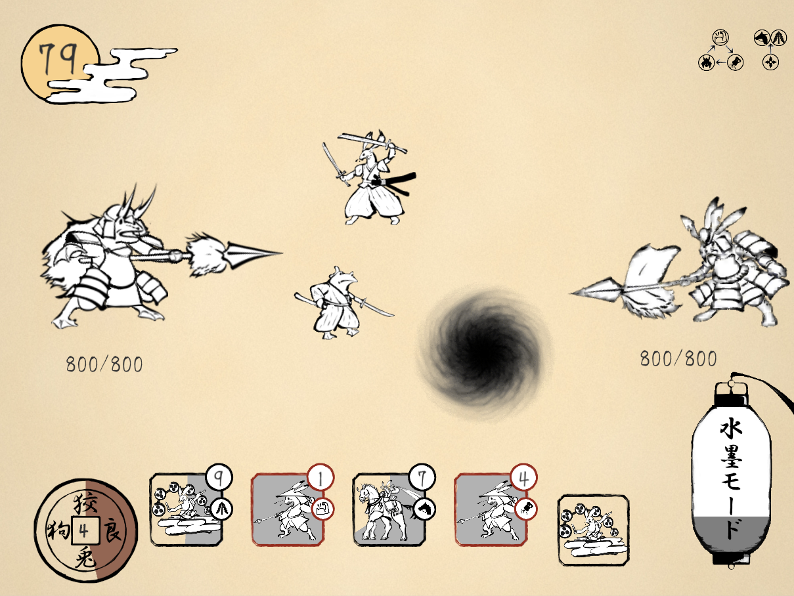

# 水墨鳥獣

<table style="width:80%">
  <tr>
    <td>制作期間</td> <td>2020.5 ~ 2021.2</td>
  </tr>

  <tr>
    <td>制作人数</td> <td>9人</td>
  </tr>
  
  <tr>
    <td>役職</td> <td bgcolor=cyan>プログラマーリーダー</td>
  </tr>
  
  <tr>
    <td>ジャンル</td> <td>タワーディフェンス</td>
  </tr>
  
  <tr>
    <td>プラットフォーム</td> <td>ios</td>
  </tr>
  
  <tr>
    <td>使用言語</td> <td>Unity C#</td>
  </tr>
  
  <tr>
    <td>GitHub</td> <td><a href="https://github.com/kumamoooooon0202/RabbitFrog.git">GitHubはこちら</a></td>
  </tr>
  
  <tr>
    <td>動画</td> <td>準備中</td>
  </tr>
</table>

# 主な作業内容

## キャラクター周り全般
## 編成画面
