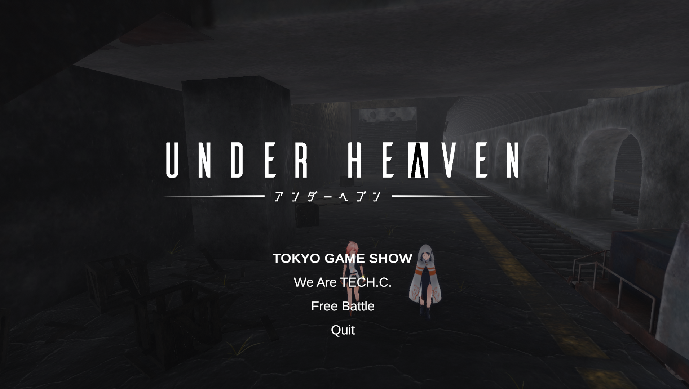
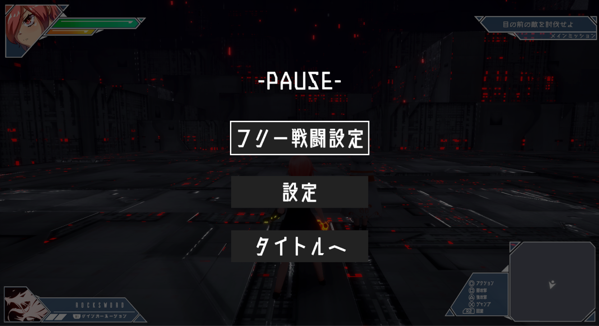
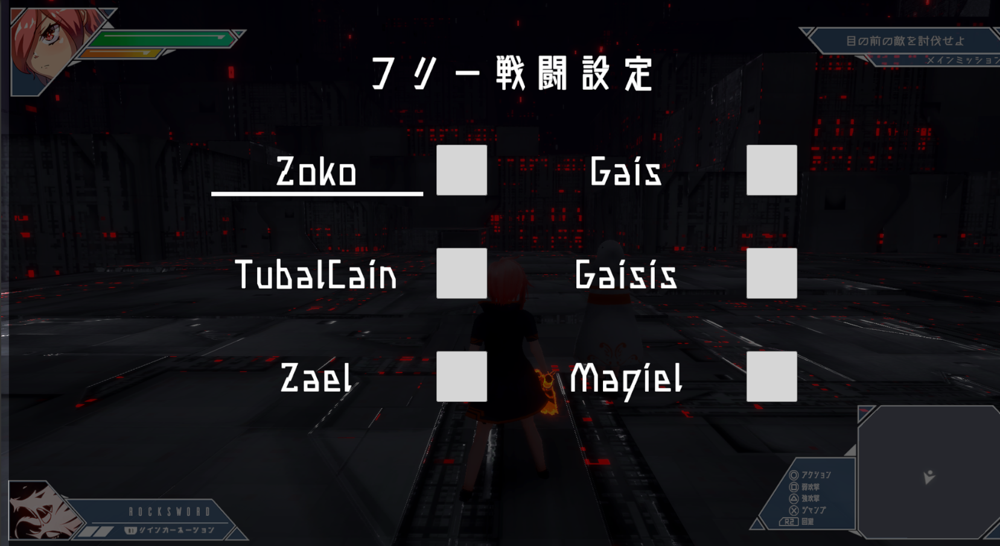
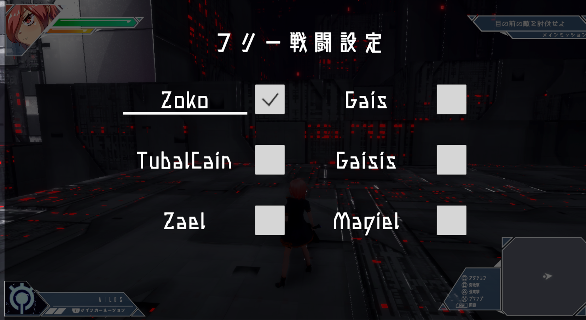
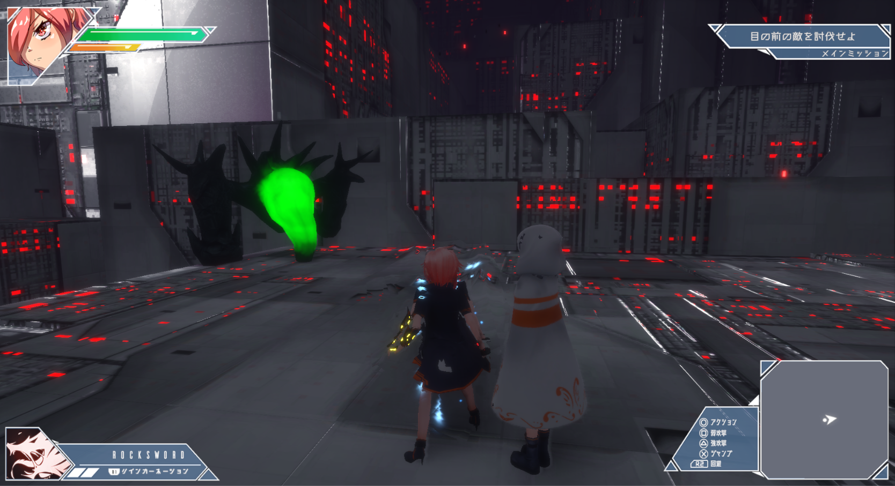
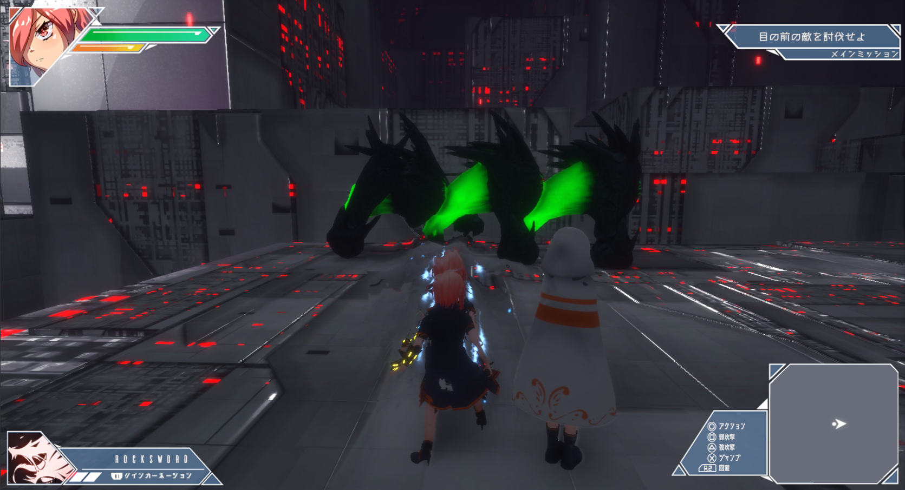

# UNDER HEAVEN


<table style="width:80%">
  <tr>
    <td>制作期間</td> <td>2019.3 ~ 2020.2</td>
  </tr>

  <tr>
    <td>制作人数</td> <td>18人</td>
  </tr>
  
  <tr>
    <td>役職</td> <td>プログラマー</td>
  </tr>
  
  <tr>
    <td>ジャンル</td> <td>アクションRPG</td>
  </tr>
  
  <tr>
    <td>プラットフォーム</td> <td>PC</td>
  </tr>
  
  <tr>
    <td>使用言語</td> <td>Unity C#</td>
  </tr>
  
  <tr>
    <td>GitHub</td> <td>非公開</td>
  </tr>
  
  <tr>
    <td>動画</td> <td>準備中</td>
  </tr>
</table>


# 主な仕事
## フリーバトルシーン全般
<table style="width:80%">
  <tr>
    <td>制作期間</td> <td>3週間</td>
  </tr>

  <tr>
    <td>制作人数</td> <td>1人</td>
  </tr>
  
  <tr>
    <td>使用言語</td> <td>Unity C#</td>
  </tr>
</table>




### 押した時の番号を参照してEnemyを生成


```csharp
    public void OnClickCreateEnemy()
    {
        // 敵の生成
        if (dataflag)
        {
            UpdateCreateEnemy();
        }

        // Enemyの削除
        if (dataflag == false)
        {
            foreach (var enemy in createEnemyList)
            {
                AIManager.DeleteEnemy(enemy);
            }

            // 敵を削除したらすべてのFlagをfalse
            for (int i = 0; i < maxCount; i++)
            {
                dataflag = false;
                dataNums = 0;
                enemyCount[i] = null;
            }
            createEnemyList.Clear();
        }
    }
```

### 敵の生成をし、カウントをする処理




```csharp
    private void CreateEnemy()
    {
        data.CreateEnemyInit();
        createEnemyList.Add(AIManager.Instance.EnemyClasses[AIManager.Instance.EnemyClasses.Count - 1]);
        for (int i = 0; i < maxCount; i++)
        {
            if (enemyCount[i] == null)
            {
                enemyCount[i] = AIManager.Instance.EnemyClasses[AIManager.Instance.EnemyClasses.Count - 1];
                break;
            }
        }
    }
```

### 死んだ敵がいたら値を減らす処理
```csharp
    private void DeathEnemyCount()
    {
        for (int i = 0; i < maxCount; i++)
        {
            if (enemyCount[i] != null)
            {
                if (enemyCount[i].IsDeath)
                {
                    dataNums--;
                    enemyCount[i] = null;
                }
            }
        }
    }
```

### 一定間隔で敵の生成
```csharp
    private void UpdateCreateEnemy()
    {
        if (dataNums >= maxCount) return;
        interval += Time.unscaledDeltaTime;
        if (interval >= createInterval)
        {
            interval = 0f;
            CreateEnemy();
            dataNums++;
        }
    }
```
